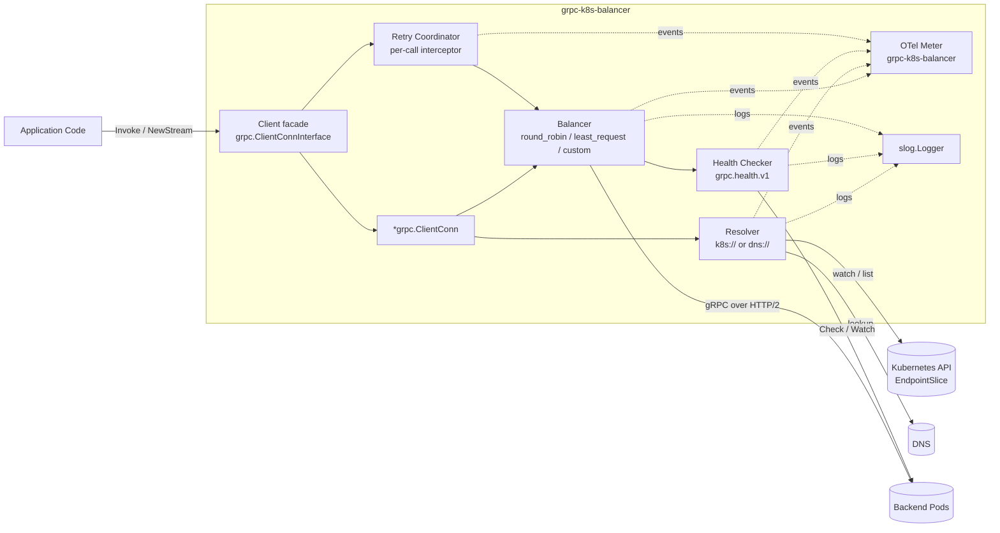
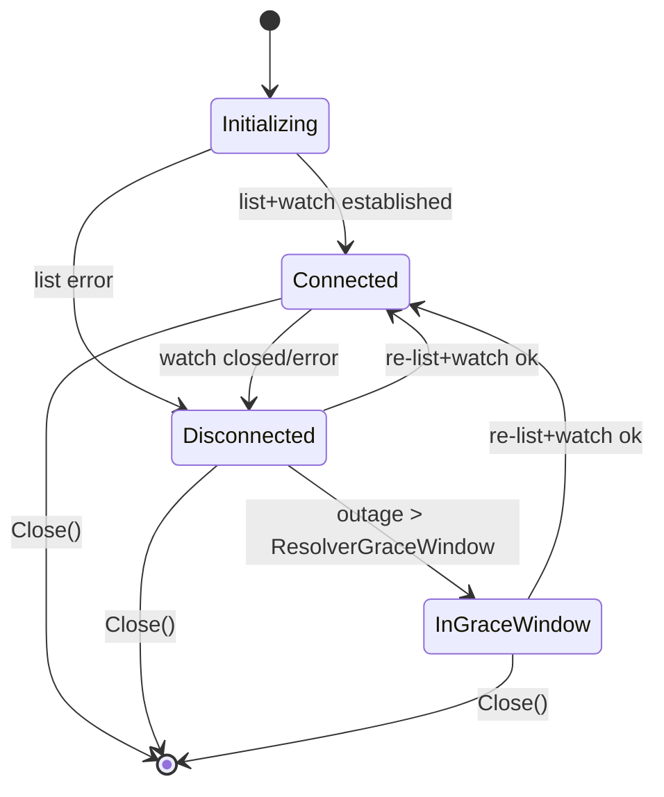
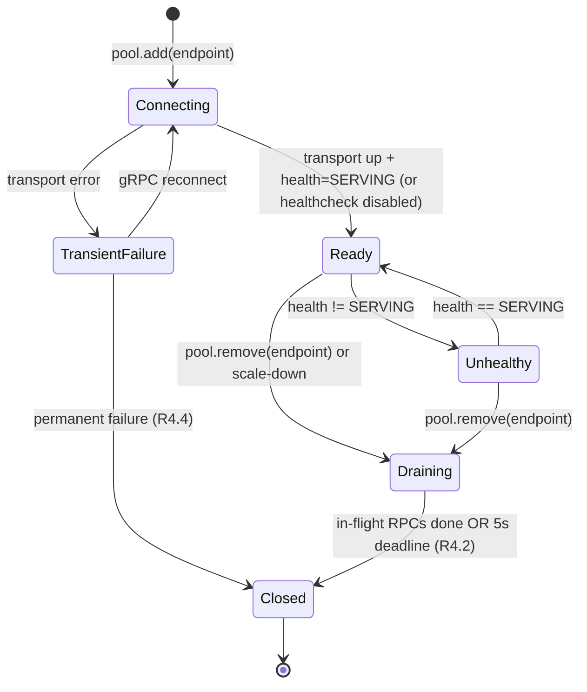
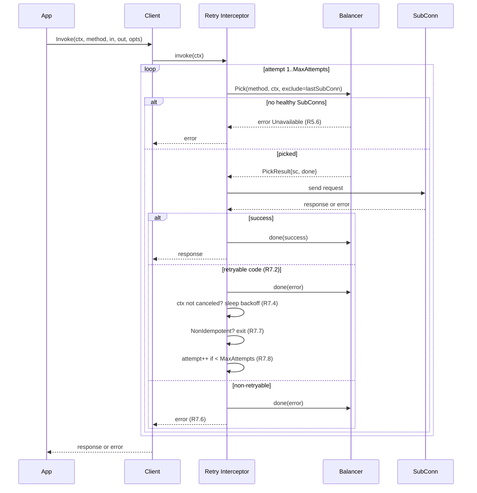

# Design Document

## Overview

`grpc-k8s-balancer` is a Go library that wraps `google.golang.org/grpc` and provides Kubernetes-native client-side load balancing, dynamic service discovery, health checking, retry, and connection lifecycle management. It is designed to remove the need for a service-mesh sidecar for east-west gRPC traffic by encapsulating Kubernetes API access, EndpointSlice watching, subconnection pooling, balancing, and per-call retry/failover behind a single public `Client` type that satisfies `grpc.ClientConnInterface`.

This design is the technical realization of `requirements.md` and is scoped by the following user-confirmed decisions:

- **Two resolver schemes**: `k8s://` (authoritative, watches `discovery.k8s.io/v1.EndpointSlice`) and `dns://` (fallback, periodic DNS A/AAAA + SRV resolution). Both are exposed through a common `Resolver` interface so the Balancer is scheme-agnostic. *Satisfies extensibility for R3, supports out-of-cluster targets.*
- **Two built-in load-balancing policies**: `round_robin` and `least_request`. Custom policies are registered through the `Picker` factory registry (R5.7).
- **Authentication**: in-cluster service account or kubeconfig only (R3.8, R3.9). Other modes (token files, exec plugins) are out of scope.
- **Watch scope**: a single namespace per Client. Multi-namespace / multi-cluster is a future extension.
- **Retry**: opt-in for non-idempotent RPCs via a per-call option (R7.7); default behavior treats unflagged calls as idempotent-eligible per `RetryableStatusCodes`.
- **Metrics**: OpenTelemetry only (R10.4); Prometheus is reachable through the OTel Prometheus exporter, not a first-party dependency.

The design favors composition over inheritance: the public `Client` is a thin facade over `*grpc.ClientConn` configured with a custom `resolver.Builder` and `balancer.Builder` registered under unique names so that gRPC's own machinery handles dial state, name resolution events, and subconnection state callbacks. This keeps the Library aligned with upstream gRPC-Go behavior and avoids re-implementing transport, codec, or interceptor pipelines.

## Architecture

### High-Level Architecture



The `Client` facade is the only surface exposed to application code. Internally, it delegates to a configured `*grpc.ClientConn` whose `resolver.Builder` and `balancer.Builder` are provided by this Library. A `Retry Coordinator` is implemented as a unary and streaming `grpc.ClientInterceptor` so retry/failover composes cleanly with user-supplied interceptors via `DialOptions` (R9.5).

### Layered Responsibility

| Layer | Responsibility | Key Requirements |
|---|---|---|
| API | Public types, constructor, `Close`, `Invoke`, `NewStream` | R1, R9, R11.1 |
| Target | Parse, validate, pretty-print Targets | R2 |
| Resolver | Discover Endpoints (k8s watch or DNS), reconcile state | R3, R8 |
| Subconn Pool | Open/close one Subconnection per Endpoint | R4, R12 |
| Balancer | Per-RPC pick using a Picker chosen by policy name | R5 |
| Health Checker | Probe Subconnections, gate Picker eligibility | R6 |
| Retry | Backoff math, attempt selection, idempotency gating | R7 |
| Observability | Counters, gauges, histograms, structured logs | R10 |

## Package Layout

```
grpc-k8s-balancer/
├── balancer.go                   // Public API: NewClient, Client interface
├── config.go                     // Public Config struct + DefaultConfig()
├── target.go                     // Public Target struct + ParseTarget/Target.String
├── errors.go                     // Sentinel errors and typed error wrappers
├── option.go                     // Per-call options (e.g., NonIdempotent)
├── internal/
│   ├── resolver/
│   │   ├── resolver.go           // Resolver interface (scheme-agnostic)
│   │   ├── k8s/
│   │   │   ├── builder.go        // grpc resolver.Builder for "k8s"
│   │   │   ├── watcher.go        // EndpointSlice list+watch loop
│   │   │   ├── reconcile.go      // Diff old vs new endpoint set
│   │   │   └── kubeclient.go     // Kubernetes client construction
│   │   └── dns/
│   │       ├── builder.go        // grpc resolver.Builder for "dns"
│   │       └── lookup.go         // Periodic DNS resolution
│   ├── balancer/
│   │   ├── builder.go            // grpc balancer.Builder, name registration
│   │   ├── pool.go               // Subconnection pool / lifecycle
│   │   ├── picker_rr.go          // round_robin Picker
│   │   ├── picker_lr.go          // least_request Picker
│   │   └── registry.go           // Custom policy registration (R5.7)
│   ├── health/
│   │   ├── checker.go            // Watch+Check fallback driver
│   │   └── state.go              // Per-subconn health state machine
│   ├── retry/
│   │   ├── interceptor.go        // Unary + stream retry interceptors
│   │   └── backoff.go            // Exponential backoff calculator
│   ├── observability/
│   │   ├── metrics.go            // OTel instruments
│   │   └── logging.go            // slog helpers, redaction
│   └── target/
│       └── parse.go              // Internal parsing primitives shared by schemes
├── examples/
│   └── ...                       // Sample programs (excluded from public API surface)
└── go.mod
```

The split between `balancer.go` (public) and `internal/balancer/` (gRPC-Go balancer plumbing) prevents application code from depending on internal types. The `internal/resolver/k8s` package is the only place that imports `k8s.io/client-go`, satisfying R1.7 by ensuring the Library transitively pulls those dependencies but the application does not need to import them.

## Components and Interfaces

### Public API

```go
// Client is the only type application code uses to invoke RPCs.
// It is safe for concurrent use by multiple goroutines (R11.1).
type Client interface {
    grpc.ClientConnInterface
    Close() error // R1.4, R1.5, R1.6, R12.3
}

// NewClient constructs a Client for the given Target.
// Returns (nil, error) for invalid input (R1.3, R2.3, R2.6, R5.3, R9.4).
func NewClient(ctx context.Context, target string, cfg *Config) (Client, error)

// DefaultConfig returns the documented default configuration (R9.3).
func DefaultConfig() *Config

// NonIdempotent marks the outgoing RPC as not safe to retry (R7.7).
// It is applied per call: client.Invoke(ctx, m, in, out, NonIdempotent())
func NonIdempotent() grpc.CallOption
```

### Configuration

```go
// Config controls Library behavior. All fields have documented defaults (R9.2).
type Config struct {
    DefaultNamespace        string                  // R2.2
    Kubeconfig              string                  // R3.9
    LoadBalancingPolicy     string                  // R5.2; "round_robin" | "least_request" | <registered>
    EnableHealthCheck       bool                    // R6.7
    HealthCheckServiceName  string                  // R6.2
    HealthCheckInterval     time.Duration           // R6.8
    HealthCheckTimeout      time.Duration           // R6.6
    RetryPolicy             RetryPolicy             // R7.1
    ResolverGraceWindow     time.Duration           // R8.5
    MaxSubconnections       int                     // R12.1, R12.2 (0 = unbounded)
    DialOptions             []grpc.DialOption       // R9.5
    Logger                  *slog.Logger            // R9.6
    MeterProvider           metric.MeterProvider    // R10.4 (nil => global)
}

type RetryPolicy struct {
    MaxAttempts          int           // R7.1, R7.8
    InitialBackoff       time.Duration // R7.4
    MaxBackoff           time.Duration // R7.4
    BackoffMultiplier    float64       // R7.4
    RetryableStatusCodes []codes.Code  // R7.2, R7.6
}
```

`DefaultConfig()` returns:
- `LoadBalancingPolicy`: `"round_robin"`
- `EnableHealthCheck`: `true`
- `HealthCheckInterval`: `10s`, `HealthCheckTimeout`: `2s`
- `RetryPolicy`: `MaxAttempts=3`, `InitialBackoff=100ms`, `MaxBackoff=2s`, `BackoffMultiplier=2.0`, `RetryableStatusCodes=[Unavailable, ResourceExhausted, Aborted]`
- `ResolverGraceWindow`: `30s`
- `MaxSubconnections`: `0` (unbounded)

### Target

```go
// Target identifies a logical service. Schemes: "k8s" (R3) or "dns" (fallback).
type Target struct {
    Scheme    string // "k8s" or "dns"
    Namespace string // populated for k8s; ignored for dns
    Service   string // service name (k8s) or hostname (dns)
    Port      Port   // numeric or named
}

type Port struct {
    Name   string // empty if numeric
    Number int    // 0 if named
}

// ParseTarget parses a Target string and resolves DefaultNamespace as a fallback (R2).
func ParseTarget(s string, defaultNamespace string) (Target, error)

// String pretty-prints a Target. Round-trip with ParseTarget is required by R2.5.
func (t Target) String() string
```

Accepted forms:
- `k8s:///<namespace>/<service>:<port>` (R2.1)
- `k8s:///<service>:<port>` → namespace from `DefaultNamespace` (R2.2, R2.3)
- `dns:///<host>:<port>` (fallback)

### Resolver Layer

The Library defines its own narrow `Resolver` interface that abstracts over the `k8s://` and `dns://` schemes. Both implementations register a `resolver.Builder` with gRPC under a unique scheme so the gRPC dial machinery picks the right one.

```go
// Resolver produces a stream of Endpoint snapshots.
type Resolver interface {
    // Start begins resolution. Updates are pushed to fn until ctx is canceled
    // or Close is called. Errors are reported via fn(Snapshot{Err: ...}).
    Start(ctx context.Context, fn func(Snapshot)) error
    Close() error
}

// Snapshot is the full set of currently-known Endpoints; deltas are derived by reconcile.
type Snapshot struct {
    Endpoints []Endpoint
    State     ResolverState // Connected | Disconnected | InGraceWindow
    Err       error
}

type Endpoint struct {
    Address string // host or IP
    Port    int    // resolved numeric port
    Ready   bool   // R3.2, R3.3
}

type ResolverState int
const (
    ResolverConnected ResolverState = iota
    ResolverDisconnected
    ResolverInGraceWindow
)
```

The k8s resolver uses `client-go`'s informer with `EndpointSliceInformer` filtered by label `kubernetes.io/service-name=<service>` and the Target's namespace (R3.1). The DNS resolver performs `net.DefaultResolver.LookupIPAddr` plus optional `LookupSRV` on a configurable interval (default 30 s; reused field `HealthCheckInterval` is *not* used here — DNS uses its own constant since it is a fallback path and out-of-scope for tuning per requirements).

### Balancer Layer

The Library registers a `balancer.Builder` with gRPC under the name `k8s_balancer`. The chosen `LoadBalancingPolicy` determines which `Picker` factory is used internally; gRPC's balancer machinery handles `SubConn` state callbacks.

```go
// Picker selects a Subconnection per RPC. Implementations must be safe under concurrent calls.
type Picker interface {
    Pick(info PickInfo) (PickResult, error)
}

type PickInfo struct {
    Method string
    Ctx    context.Context
}

type PickResult struct {
    SubConn balancer.SubConn
    Done    func(balancer.DoneInfo) // R5.5: decrements in-flight for least_request
}

// PickerFactory builds a Picker from the current set of healthy SubConns.
type PickerFactory func(healthy []SubConnState) Picker

// RegisterPolicy adds a custom policy; returns ErrPolicyExists if name is taken (R5.7).
func RegisterPolicy(name string, factory PickerFactory) error
```

Built-in factories:
- `round_robin`: atomic counter modulo N (R5.4 distribution invariant).
- `least_request`: scans `healthy`, returns the SubConn with the smallest `InFlight`. Ties broken by lexicographic `address:port` for determinism (R5.5).

Both factories are pure functions of `healthy`; the Balancer rebuilds the active Picker whenever the healthy set changes. This guarantees Picker immutability and eliminates a class of data races in the hot path.

### Health Checker

```go
type HealthChecker interface {
    Watch(ctx context.Context, sc balancer.SubConn) (<-chan HealthState, error)
}

type HealthState int
const (
    HealthUnknown HealthState = iota
    HealthServing
    HealthNotServing
)
```

The default implementation issues `grpc.health.v1.Health/Watch` (R6.8). On `Unimplemented`, it falls back to periodic `Check` calls every `HealthCheckInterval` until the SubConn is closed or context is canceled. Each transition produces a `HealthState` event consumed by the Balancer to update the healthy set.

When `EnableHealthCheck=false`, the checker yields a single `HealthServing` event per SubConn and exits, so all SubConns are considered healthy without any probe traffic (R6.7).

### Retry Coordinator

Implemented as a pair of interceptors (`UnaryClientInterceptor`, `StreamClientInterceptor`) wired into the dial via internal `DialOption`s prepended to user-supplied options.

```go
type retryCoordinator struct {
    policy RetryPolicy
    clock  clock.Clock // injectable for tests
}

// attemptBackoff returns the sleep duration for the n-th attempt (1-indexed).
// duration = min(MaxBackoff, InitialBackoff * BackoffMultiplier^(n-1))  (R7.4)
func (r *retryCoordinator) attemptBackoff(attempt int) time.Duration
```

Per-call decision tree:
1. If user passed `NonIdempotent()`, do not retry (R7.7).
2. If `MaxAttempts <= 1`, do not retry (R7.8).
3. On error, if `status.Code(err)` is in `RetryableStatusCodes`, sleep `attemptBackoff(n)` then re-issue, asking the Balancer for a *different* SubConn when ≥2 healthy exist (R7.3).
4. If `ctx.Err() != nil` during sleep or attempt, stop and return the most recent error wrapped with `context.DeadlineExceeded` cause (R7.5).

Streaming RPCs are retryable only before the first message is sent on the wire; once the first send completes, retry is disabled for that stream. This matches gRPC retry semantics and avoids violating message-ordering invariants.

### Observability

Metrics are emitted through OTel's `metric.Meter` named `grpc-k8s-balancer` (R10.4). Instruments:

| Instrument | Type | Labels | Requirement |
|---|---|---|---|
| `rpc.started` | counter | `method` | R10.1 |
| `rpc.completed` | counter | `method`, `code` | R10.1 |
| `rpc.errors` | counter | `method`, `code` | R10.1 |
| `subconn.created` | counter | `endpoint` | R10.1, R4.7 |
| `subconn.closed` | counter | `endpoint`, `reason` | R10.1, R4.7 |
| `subconn.healthy` | up-down counter (gauge) | (none) | R10.2 |
| `subconn.unhealthy` | up-down counter (gauge) | (none) | R10.2 |
| `resolver.state` | up-down counter (gauge) | `state` | R10.2 |
| `rpc.latency_ms` | histogram | `method`, `code` | R10.3 |

Logs use `log/slog`. Default logger is `slog.Default()` unless `Config.Logger` is set (R9.6).

## Data Models

### Subconnection State

```go
type SubConnState struct {
    Endpoint        Endpoint
    SubConn         balancer.SubConn
    Health          HealthState   // R6
    Connectivity    connectivity.State // upstream gRPC state
    InFlight        int64          // atomic; used by least_request (R5.5)
    Draining        bool           // R4.2, R4.3
    CreatedAt       time.Time
    LastHealthEvent time.Time
}
```

### Endpoint Set Reconciliation

The reconcile algorithm runs on every Resolver `Snapshot`:

```
inputs:
  current = current SubConn keys, set of (address, port)
  desired = ready endpoints from Snapshot, keyed by (address, port)
  cap     = MaxSubconnections (0 means unbounded)

if cap > 0:
  desired = first cap entries of desired sorted lex by "address:port"  // R12.2

toAdd    = desired \ current
toRemove = current \ desired

for k in toRemove: mark draining; close after drain or 5s deadline   // R4.2, R4.3
for k in toAdd:    create exactly one SubConn                        // R4.1, R4.5
```

The `(namespace, service, address, port)` tuple is the SubConn identity; it is used as a map key inside the pool to enforce R4.5. When a Pod restarts and reuses the same `address:port`, gRPC's connectivity state transitions trigger pool eviction *before* the new SubConn is created, satisfying R4.6.

### Resolver State Machine



Transitions:
- `Initializing → Connected`: initial list succeeds; first Snapshot is emitted with the full Endpoint set.
- `Connected → Disconnected`: watch ends with an error; backoff timer starts at 1 s, doubles, caps at 30 s (R3.5).
- `Disconnected → Connected`: re-list succeeds; the new Snapshot is reconciled against current SubConns (R3.6, R8.3, R8.4).
- `Disconnected → InGraceWindow`: cumulative outage exceeds `ResolverGraceWindow`; the Library keeps the last-known Endpoint set and emits a WARN log every `ResolverGraceWindow` (R8.5).
- `InGraceWindow → Connected`: connectivity restored; reconcile.

### Subconnection Lifecycle State Machine



- Only `Ready` SubConns are eligible for picking (R5.4, R5.5, R5.6).
- `Unhealthy` SubConns are *not* picked but remain in the pool and continue health probing (R6.4, R6.5).
- `Draining` blocks new picks (R4.3) but allows existing in-flight RPCs to finish until the 5 s deadline (R4.2).
- `TransientFailure → Closed` triggers a Resolver re-verification request (R4.4).

### RPC Dispatch Flow with Retry/Failover



## Concurrency Model

- **Resolver loop**: a single goroutine per Client owns the watch. It pushes Snapshots to a buffered channel (capacity 1, dropping older snapshots since only the latest matters) consumed by the reconcile goroutine.
- **Reconcile goroutine**: a single goroutine owns the SubConn pool's mutable state. All add/remove operations are serialized through it. Pool reads (used by Picker construction) take a read-only snapshot via `atomic.Pointer[poolSnapshot]`. *Satisfies R11.2 — there is exactly one writer per data structure.*
- **Picker**: immutable; rebuilt by the reconcile goroutine on healthy-set changes and atomically swapped via `atomic.Pointer[Picker]`. Pickers contain only the data they need (the slice of SubConns and an internal counter for `round_robin`). The hot RPC path performs a single atomic load.
- **Health checker goroutines**: one per SubConn, owning the Watch stream. They publish state transitions via a single channel back to the reconcile goroutine.
- **Retry interceptor**: runs on the caller's goroutine; never blocks more than `RetryPolicy` permits.
- **Close coordination**: a `sync.WaitGroup` tracks every goroutine the Client spawns. `Close()` cancels the root context and `Wait`s. A `sync.Once` guards `Close()` to make repeated calls a no-op (R1.6, R12.3).

If a SubConn is selected by the Picker but is being closed concurrently, the gRPC layer surfaces a transient error; the Retry Coordinator treats this as retryable and re-picks (R11.3). This is internal recovery — the application never sees the close as an error.

## Correctness Properties

*A property is a characteristic or behavior that should hold true across all valid executions of a system — essentially, a formal statement about what the system should do. Properties serve as the bridge between human-readable specifications and machine-verifiable correctness guarantees.*

